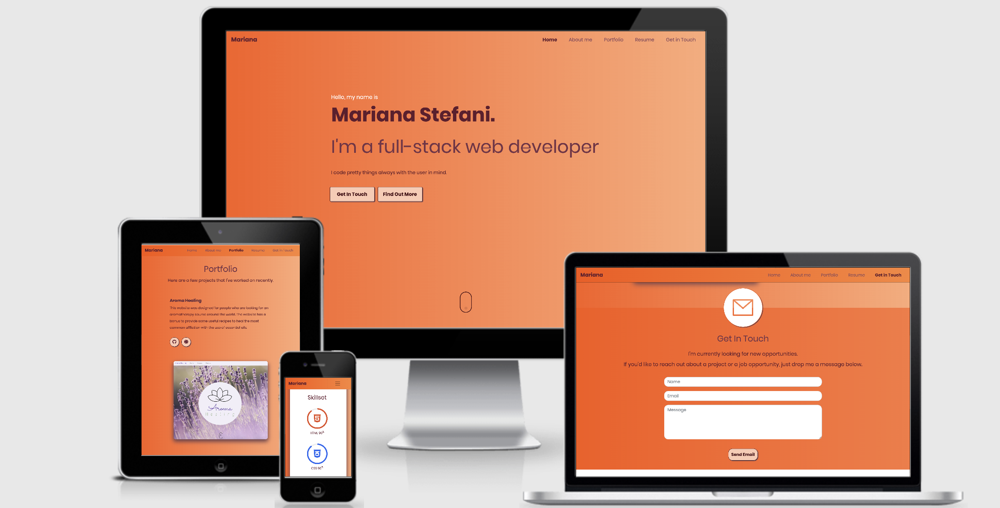

# Portfolio



## Introduction

[This project](https://marianastefani-portfolio.herokuapp.com/) was created by me, Mariana Stefani, to be my portfolio with my latest projects and information about me and my skillset.

## UX (User Experience)

### Project Goals

The goal of this project is the ability to present my professional profile, my skills and my abilities as a software developer for recruiters, employers and potential partners that are looking for a full-stack developer.
For myself, there is a possibility to login and then create, update and delete a skill or a project from **MongoDB**.
The website is fully responsive, has a consistent flow and intuitive navigation.

#### **User Goals:**

- Find a junior developer with well-written projects and good skills to invite for an interview.
- Find a junior developer that still is looking for a job and invite to join a freelance project.
- Find a developer to build a website for my shop.

#### **User Stories:**

- As a user, I expect to contact the developer in a built-in contact form.
- As a user, I expect to with a click of a button to be able to see the developer’s CV on a new tab instead of having to download it.
- As a user, I expect to easily find the developer's latest projects with buttons that will redirect me to the live website and the **GitHub** repository.
- As a user, I expect to easily find information about the developer’s skills proficiency.

**Emily S.**

_“As a recruiter, I want to be able to find with easy the live website of the projects the developer has done in the past. The ideal website would have a section with these with a frame of the project. When I click on these frames I would expect it to redirect me to the live project.”_

**Jill G.**

_“Having a small startup, I’m always looking for partners for new projects. It’s very important when I’m on a portfolio website that I can easily find a way to contact the developer, ideally with a built-in form. Also, I feel more connected to the developer if there’s a picture of him/ her on the about me section.”_

**Mr Bridgeman**

_“When I’m looking for a new employee it’s important to be able to see the developers code and what skills he or she have already learned. When looking through a portfolio I expect the skills section to be easily readable and to clearly show how much of each skill the developer knows approximately. I also expect a link to the developer’s GitHub repository, so I can go read the developer’s code.”_

#### **Site Owner Goals:**

As an admin user:

- I expect to be able to log in on a hidden page when using “/admin” at the end of the index URL.
- I expect to be able to create and update a skillset and/or a project through a form to **MongoDB**.
- I expect to be able to delete a skillset and/or a project from **MongoDB**.
- I want to receive interview offers through the use of contact form.
- I need to be able to attract attention to my projects.
- I want to sell myself in a profession but still a personal way.

## User Requirements and Expectations:

**Requirements:**

- Navigate through the sections of the portfolio in one single page.
- The content displayed in a visually appealing manner.
- Be provided with a contact form, to easily contact the developer.
- Be able to see a live version of the developer projects.

**Expectations:**

- Navigation takes the user directly to the desired section of the portfolio.
- CV opens in a new tab when clicked.
- The contact form sends the message correctly to the developer's email inbox.
- Content is well presented and visually satisfying.

## Wireframes

The wireframes for this project were created at [Moqups](https://moqups.com/).
View my wireframes [here](https://github.com/mariana-stefani/portfolio/tree/master/wireframes).

## Features

### Existing Features

**Navbar**

- For users, it includes the following links:

  - Home
  - About me
  - Portfolio
  - Resume
  - Get in Touch

- For admin user, it includes the following links:

  - Home
  - Logout

- Python will evaluate if the admin user is logged in by checking `if 'username' in session` and passes this data to Jinja to display the correct navbar.

- In smaller screens, the navbar is collapsed and a burger icon is displayed.

#### **Index Page**

**Callout container**

- In this container, the user will find a brief introduction about myself.

**Callout Toast**

- When the user logs in, creates, edit, update or delete a project and/or a skillset a toast message is shown on the top of the page.

**About container**

- In this container the user will find my profile picture, a brief description about me and my skillset with the percentages learned of each skill.

**Skillset Progress Circle**

- This progress circle will move accordingly to the percentage learned in each skill.

**Projects Container**

- In this container, the user will find the projects I have worked on recently. It contains a picture of the project in a desktop screen along with a brief description of the project and two buttons for the project's **GitHub** repository and the project's live website. If the admin user is logged in, three buttons will be shown to add, edit and/or delete a project.

**Contact Form Container**

- In this container, there is a contact form where the user can enter his/her name, email address and send me a message.

**Contact Toast**

- When the user sends a message a toast message is shown above the contact form.

**Footer**

- It contains links to social media pages that the user can click if they would like to follow me on social media platforms.

#### **Admin Page**

**Login form**

- This page has a login form with username, password and a login button.

**Login Toast**

- When the user fails to enter the correct username and/or password a toast message is shown above the login form.

#### **Add New Skill Page**

- This page has a form with 4 fields that can be filled with the new skill information to be sent to **MongoDB**.
- Next to each field title, there's a tooltip. When the admin user hovers the pointer over the tooltip it will display information about what the admin user is expected to write on that field.

#### **Edit Skill Page**

- This page has a form with 4 fields filled with information retrieved from **MongoDB**, based on the skill ID. These fields can be altered to update an existing skill.

#### **Add New Project Page**

- This page has a form with 7 fields that can be filled with the new project information to be sent to **MongoDB**.
- Next to each field title, there's a tooltip. When the admin user hovers the pointer over the tooltip it will display information about what the admin user is expected to write on that field.

#### **Edit Project Page**

- This page has a form with 7 fields filled with information retrieved from **MongoDB**, based on the project ID. These fields can be altered to update an existing project.

### Features Left to implement

- Add more projects.
- Add more skills.
- Add more classes for the skills colours.
- Add a dropdown menu for the **"Add New Skill"** page and for the **"Edit Skill"** page, where the admin user can select among many skills so the skill colour and icon will be automatically added with the selected skill.
- Update the _resume_ link with my real resume.

## Information Architecture

### Database Choice

This project utilizes the **NoSQL** database **MongoDB**.

### Data Storage Types

For this project the following data types were stored in **MongoDB**:

- Integer
- ObjectID
- String

### Collections Data Structure

This uses three database collections:

#### Projects Collection

| _Title_                | _Key in DB_     | _Form Validation type_ | _Data type_ |
| ---------------------- | --------------- | ---------------------- | ----------- |
| Account ID             | \_id            | None                   | ObjectId    |
| Project Name           | project_name    | text                   | string      |
| Description of Project | project_desc    | text, maxlength="245"  | string      |
| Github Repository      | project_github  | text                   | string      |
| Project URL            | project_live    | text                   | string      |
| Project Image URL      | project_img     | text                   | string      |
| Project Order          | project_order   | text                   | string      |
| Project Divider Line   | project_divider | text                   | string      |

[Example JSON from the _projects_ collection](https://github.com/mariana-stefani/portfolio/blob/master/data/schemas/projects.json)

#### Skills Collection

| _Title_            | _Key in DB_ | _Form Validation type_     | _Data type_ |
| ------------------ | ----------- | -------------------------- | ----------- |
| Account ID         | \_id        | None                       | ObjectId    |
| Skill              | skill_name  | text                       | string      |
| Percentage learned | percent     | number, min="1", max="100" | integer     |
| Skill colour class | colour      | text                       | string      |
| Icon ID            | icon        | text                       | string      |

[Example JSON from the _skills_ collection](https://github.com/mariana-stefani/portfolio/blob/master/data/schemas/skills.json)

#### Users Collection

| _Title_    | _Key in DB_ | _Form Validation type_              | _Data type_ |
| ---------- | ----------- | ----------------------------------- | ----------- |
| Account ID | \_id        | None                                | ObjectId    |
| Username   | username    | text, minlength="3", maxlength="15" | string      |
| Password   | password    | text, minlength="3", maxlength="15" | string      |

[Example JSON from the _users_ collection](https://github.com/mariana-stefani/portfolio/blob/master/data/schemas/users.json)

## Technologies Used

The technologies used were:

### Languages

- [HTML](https://developer.mozilla.org/en-US/docs/Web/Guide/HTML/HTML5)
- [CSS](https://developer.mozilla.org/en-US/docs/Web/CSS/CSS3)
- [JavaScript](https://developer.mozilla.org/en-US/docs/Web/JavaScript)
- [Python](https://www.python.org/)

### Libraries

- [Bootstrap](https://getbootstrap.com/docs/4.4/getting-started/introduction/)
- [Flask](https://flask.palletsprojects.com/en/1.1.x/#)
- [Font Awesome](https://fontawesome.com/icons)
- [Google Fonts](https://fonts.google.com/)
- [JQuery](https://jquery.com)
- [PopperJS](https://popper.js.org/)
- [Pymongo](https://pymongo.readthedocs.io/en/stable/)

### Tools

- [Am I Responsive](http://ami.responsivedesign.is/)
- [Docdroid](https://www.docdroid.net/)
- [EmailJS](https://www.emailjs.com/)
- [Flat Icon](https://www.flaticon.com/)
- [Free Image Host](https://freeimage.host/)
- [Git](https://github.com/)
- [Heroku](http://www.heroku.com)
- [MongoDB Atlas](https://www.mongodb.com/cloud/atlas)
- [Moqups](https://moqups.com/)
- [Visual Studio Code](https://code.visualstudio.com/)

## Testing

- HTML was checked on [HTML Validator](https://validator.w3.org/).
- CSS was checked on [CSS Validator](http://csslint.net/).
- JavaScript was checked on [JS Hint Validator](https://jshint.com/).
- JSON was checked on [JSON Validator](https://jsonlint.com/).
- The responsiveness of this website was tested constantly during the development process. It was tested in real desktops, tablets and mobile devices as well as on Google Chrome developer tools.
- The website was tested on different browsers such as Google Chrome, Safari, Internet Explorer and Mozilla Firefox.
- I asked friends and family members to test the functionalities of the website on desktop and mobile devices. Their feedback was used to improve website usability.

### Tests

**Navbar Links**

- **Plan:** User clicks on each navbar link and is scrolled to the chosen section.
- **Result:** This test passed.

**Callout Button**

- **Plan:** User clicks the **_“Get in Touch”_** button and page scrolls down to contact me form.
- **Result:** This test has passed.

**About Buttons – When User is Logged In:**

- **Plan 1:** User clicks on Add New Skill and/or Edit button is redirected to Add New Skill and/or Edit Skill page.
- **Plan 2:** User clicks on the Delete button and the skill is deleted from the database.
- **Result:** Both tests have passed.

**Project Buttons**

- **Plan:** User clicks on the project repository page and/or project live website and is redirected to the pages in a separate tab on the browser.
- **Result:** This test has passed.

**Project Buttons – When _Admin User_ is Logged In**

- **Plan 1:** User clicks on Add New Project and/or Edit button is redirected to Add New Project and/or Edit Project page.
- **Plan 2:** User clicks on the Delete button and the project is deleted from the database.
- **Result:** Both tests have passed.

**Contact Me Form**

- **Plan:** After filling all necessary information email is successfully send and a toast message is shown above the form confirming the email was sent.
- **Result:** This test has passed.

**Login Page**

- **Plan 1:** A toast message is shown when the user tries to log in with a username and/or password that are different from the ones stored on the database.
- **Plan 2:** User is redirected to the index page and a toast message is shown if correct username and password are entered.
- **Result:** Both tests have passed.

## Note for the assessor

To test the CRUDs functionalities:

| **URL**                                              | **Username** | **Password** |
| ---------------------------------------------------- | ------------ | ------------ |
| https://marianastefani-portfolio.herokuapp.com/admin | testuser     | test         |

## Bugs

### Solved bugs

- **Bug 1**

  - **Problem:** The project was failing to open when the “Open App” button was clicked on the **Heroku** website.
  - **Solution:** This was fixed by adding **_MONGO_DBNAME_**, **_MONGO_URI_** and **_SECRET_KEY_** to **Heroku** config vars.

- **Bug 2**

  - **Problem:** On small screens, the navbar dropdown button was not working.
  - **Solution:** I fixed the issue updating the JQuery script from version 3.5.0 to version 3.5.

- **Bug 3**

  - **Problem:** When importing the layout pages within jinja to _base.html_ nothing was rendering.
  - **Solution:** This was fixed when with some research I found that I had to include _“”_.

- **Bug 4**

  - **Problem:** When opening the project on mobile devices the images were not loading.
  - **Solution:** I changed all the images extensions from _webp_ to _png_.

- **Bug 5**
  - **Problem:** When opening the project on mobile devices the _progress-circle_ colours were not loading, even after a refresh of the page.
  - **Solution:** On _script.js_ I removed the immediately invoked function expression from _emaijs_ function.

### Unsolved bugs

- When loading the project on mobile devices sometimes the _progress-circle_ colours doesn't load, only after a refresh of the page.
- When loading the project on mobile devices sometimes the _scroll-down_ animation doesn't go all the way to the bottom of the mouse, only fades in and out on the top of the mouse.

## Deployment

- The deployment instructions were written for a **_macOS_** specifically. The commands and installation may differ if you are in a different Operating System, please follow the guides for the same according to their specs.

### Run the Code Locally

- The following **must** be installed in your machine:

  - [Homebrew](https://docs.brew.sh/Installation) \* [Git](https://www.atlassian.com/git/tutorials/install-git)
  - [Heroku CLI](https://devcenter.heroku.com/articles/heroku-cli) \* [MongoDB](https://docs.mongodb.com/manual/administration/install-community/)
  - [MongoDB Atlas Account](https://www.mongodb.com/cloud/atlas)
    - [Documentation](https://docs.atlas.mongodb.com/) to set up a **MongoDB Atlas** account.
      - [PIP](https://pip.pypa.io/en/stable/installing/)
      - [Python 3](https://www.python.org/downloads/)

- This project was developed using [Visual Studio Code](https://code.visualstudio.com/) IDE and cloned to a [Git Repository](https://github.com/mariana-stefani/portfolio).

- To clone a **Github** repository:

      	* Open the [repository](https://github.com/mariana-stefani/portfolio) on **Github** and click on ***"Clone or download"*** and copy the URL.

      	* On VSCode open the ***"Command Palette"***, select ***"Git: Clone"*** and paste the URL.

- Install Pipenv Globally:
  _ If needed, upgrade pip from your computer's terminal by running `$ python3.8 -m pip install pip --upgrade`.
  _ To install Pipenv globally, run from your computer's terminal `$ python3.8 -m pip install pipenv`.
- Create a Virtual Environment with Pipenv:
  * Open VSCode and from its terminal make a *Projects* directory by running `$ mkdir Projects`.
  * Create an empty folder for this project inside the _˜/Projects_ directory by running:
  `mkdir ˜/Projects/Portfolio pipenv install --python 3.8`
  _ Initialize the Virtual Environment: `$ cd ~/Projects/Portfolio`.
  _ Activate the Virtual Environment: `$ pipenv shell`.
  _ On VSCode dialogue will be shown asking if you'd like to select this new virtual environment for the workspace folder. Click yes.
  _ Open the **"Command Palette"** and select **_"Python: Select Interpreter"_**. \* Select the virtual environment that you just created.
- Install the necessary libraries by running `$ pip3 install -r requirements.txt` from VSCode terminal.
- Create a file called **_"env.py"_** and store your **_SECRET_KEY_** variable, your **_MONGO_URI_** to link to your database, your cluster name in **_MONGODB_NAME_**. The cluster name for this project is **_Portfolio_**. You will find the JSON structure for this cluster collections in the [schemas](https://github.com/mariana-stefani/portfolio/tree/master/data/schemas) folder.
  - Do not commit this file to **Git**. \* To hide your environment variables, create a file called **_".gitignore"_** and write **_"env.py"_** on this file.
- Run your application with the command `$ python3 app.py`.
- The project can be viewed at **_Http://127.0.0.1:5000_**.

### Heroku Deployment

#### To deploy this project to Heroku follow the steps below:

1. Install **Heroku CLI** in your computer by running `$ brew tap heroku/brew && brew install heroku`.
2. On VSCode terminal run the command `$ pip3 freeze --local > requirements.txt` to create a **_requirements.txt_** file.
3. Run the command `$ echo web: python app.py > Procfile` to create a **_Procfile_**.
4. Deploy each change to **Github**:

```
$ git add .
$ git commit -m 'Commit message'
$ git push
```

5. Create a free account on the [Heroku website](https://signup.heroku.com).
6. On your **Heroku** dashboard click on the **_New_** button and then on **_Create new app_**. Give it a unique name and select Europe as the region.
7. From your dashboard click on **_Settings_** > **_Reveal Config Vars_**.
8. Add the following config vars:

| _KEY_        | _VALUE_                                                                                                                |
| ------------ | ---------------------------------------------------------------------------------------------------------------------- |
| IP           | 0.0.0.0                                                                                                                |
| PORT         | 5000                                                                                                                   |
| MONGO_DBNAME | <project_name>                                                                                                         |
| MONGO_URI    | mongodb+srv://<username>:HsP6P7T7MUJ4Eniv@<cluster_name>-o5dej.mongodb.net/<database_name>?retryWrites=true&w=majority |
| SECRET_KEY   | <your_secret_key>                                                                                                      |

- To get your **_MONGO_URI_** log in to your **MongoDB** account > click on the cluster for this project > Click on connect > Select _Connect your application_ > Copy the URI.

6. On VSCode terminal run the command `$ heroku login` to log in to your account.
7. Link **Heroku** to **Git** with the following by running `$ heroku git:remote -a <yourproject>`.
8. Deploy your project to **Heroku** by running `$ git push heroku master`.
9. Your project is now successfully deployed to **Heroku**.
10. On your **Heroku** dashboard click on the button **_Open app_** on the top right side to view your deployed project.

## Credits

### Media

- Responsiveness across devices image from [Am I Responsive](http://ami.responsivedesign.is/).
- Icons used on the _Get in Touch_ section is made by **_iconixar_** from [Flat Icon](https://www.flaticon.com/).
- The **_resume_** linked on the navbar was hosted on [Docdroid](https://www.docdroid.net/).

## Acknowledgements

All my gratitude to my **wonderful husband** and **family** who have always supported me. A big thank you to my mentor [**Simen Daehlin**](https://github.com/Eventyret) for your ideas, advise and support! Thank you to [**Anna Greaves**](https://github.com/AJGreaves), [**Haley Schafer**](https://github.com/hschafer2017), [**Luca Dettorre**](https://github.com/ldettorre), [**Michael Park**](https://github.com/mparkcode), [**Stephen Moody**](https://github.com/DarilliGames) and [**Tim Nelson**](https://github.com/TravelTimN) from Code Institute for your time and assistance. Thank you to [**Guillermo Brachetta**](https://github.com/GBrachetta) and **Igor Basuga** from Slack. Thank you to everyone from **Code Institute**!
